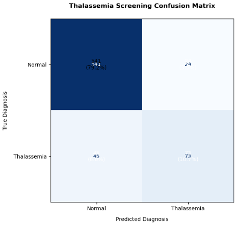
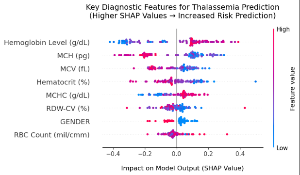
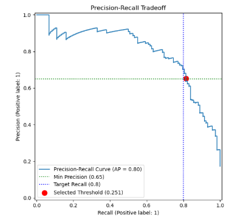

# 🩺 AI-Powered Thalassemia Screening

A machine learning-based clinical decision support system for detecting thalassemia from blood electrophoresis features. This project focuses on maximizing clinical safety by minimizing false positives while maintaining high detection sensitivity, using an optimized XGBoost model validated through rigorous statistical analysis.

---

## 📖 Project Overview

This system analyzes blood test parameters to screen for thalassemia with clinical safety as the primary objective. The model was developed and validated using real-world patient data, with a focus on:

- **Clinical Safety First**: Prioritizing minimization of false positives (misdiagnosing healthy patients)
- **Interpretable AI**: Using SHAP values to ensure model decisions are clinically explainable
- **Robust Validation**: Employing stratified cross-validation and threshold optimization
- **Tiered Risk Assessment**: Providing actionable clinical recommendations (Immediate Treatment, Urgent Testing, Routine Follow-up)

---

## 🚀 Features

- 🎯 **Clinical Safety Optimization**: <4.2% false positive rate achieved through custom threshold tuning
- 📊 **Multi-Model Evaluation**: Comprehensive testing of Logistic Regression, Random Forest, SVM, and XGBoost
- ⚖️ **Class Imbalance Handling**: Advanced CTGAN synthetic data generation for balanced training
- 🔍 **Model Interpretability**: SHAP analysis for transparent, clinically-validated decision making
- 🏷️ **Tiered Clinical Output**: Actionable recommendations rather than binary classifications
- 📈 **Comprehensive Metrics**: ROC-AUC (0.916), Precision (0.65), Recall (0.81), F1-Score (0.72)

---

## 🧠 Key Technical Components

| Component | Description |
|-----------|-------------|
| **Data Preprocessing** | Handling missing values, feature encoding, CTGAN oversampling |
| **Feature Engineering** | Mentzer Index calculation, clinical feature selection |
| **Model Optimization** | Hyperparameter tuning, clinical cost-function optimization |
| **Threshold Selection** | Precision-recall tradeoff analysis for clinical safety |
| **Model Interpretation** | SHAP values for feature importance and individual predictions |
| **Validation Framework** | Stratified k-fold cross-validation, train-test performance comparison |

---

## 📊 Performance Metrics

| Metric | Normal Class | Thalassemia Class | Overall |
|--------|--------------|-------------------|---------|
| **Precision** | 0.96 | 0.65 | 0.91 |
| **Recall** | 0.88 | 0.81 | 0.89 |
| **F1-Score** | 0.92 | 0.72 | 0.90 |
| **Support** | 565 | 118 | 683 |

**ROC-AUC**: 0.916 ± 0.006 (Stratified 5-Fold CV)

---

## 💻 Technologies Used

- **Programming Language**: Python 3.8+
- **Machine Learning**: Scikit-learn, XGBoost, CTGAN
- **Data Analysis**: Pandas, NumPy, SciPy
- **Visualization**: Matplotlib, Seaborn, Plotly, SHAP
- **Validation**: StratifiedKFold, cross_val_score, precision_recall_curve
- **Environment**: Jupyter Notebook

---

## 📁 Project Structure

```text
thalassemia-screening/
├── notebook/            # Jupyter notebook for analysis
│ └──Thalassemia-Model-CTGAN.ipynb
├── doc/                 # Source code modules
│ ├── Thalassaemia-Model-Report.pdf
│ ├── Thalassaemia-Model-Report.md
│ └──results/             # Generated outputs and visualizations
│   ├── confusion_matrix.png
│   ├── feature_importance.png
│   ├── roc-curve.png
│   └── precision-recall-curve.png
└── README.md
```

---

## 🚀 Getting Started

### Prerequisites
```bash
pip install -r requirements.txt
```
### Basic Usage
```python
from src.modeling import ThalassemiaScreener
from src.preprocessing import load_and_preprocess_data

# Load and preprocess data
X, y = load_and_preprocess_data('data/patient_data.csv')

# Initialize and use the screener
screener = ThalassemiaScreener()
screener.fit(X, y)
predictions = screener.predict(X_new, return_probs=True)
```

---

## 📊 Results Interpretation

The model provides three levels of clinical recommendations:
1. **Immediate Treatment:** SVM ≥0.65 AND XGB ≥0.70
2. **Urgent Testing:** XGB ≥0.75
3. **Routine Follow-up:** SVM ≥0.45 AND XGB ≥0.55
### Clinical Impact:
- 81.4% of thalassemia cases detected
- Only 4.2% false positive rate (healthy → thalassemia)
- 58.5% of true cases flagged for immediate treatment

---

## 🔬 Key Findings

- **Top Predictive Features:** MCV, MCH, RBC Count, RDW-CV (validates clinical knowledge)
- **Optimal Threshold:** 0.251 (vs default 0.5) for clinical safety
- **Gender Impact:** Negligible predictive value (removed from final model)
- **Model Stability:** Low standard deviation in cross-validation metrics

---

## 👤 Author

[Aleeza Rizwan](https://github.com/its-aleezA) - Research Intern, BRISC Team
Supervisor: Dr. Usman Akram, Head of Department

---

## 🙏 Acknowledgments

This project was made possible through the support and guidance of:
- **Dr. Usman Akram** for exceptional mentorship and clinical insights
- The entire **BRISC (BIOMISA Research & Innovation Student Club) Team** for providing this incredible opportunity

---

## 📄 Citation

If you use this work in your research, please cite:
```bibtex
@software{thalassemia_screening_2024,
  title = {AI-Powered Thalassemia Screening with Clinical Safety Optimization},
  author = {Rizwan, Aleeza},
  year = {2025},
  publisher = {GitHub},
  journal = {GitHub repository},
  howpublished = {\url{https://github.com/its-aleezA/ai-powered-thalassemia-screening}}
}
```

---

_Disclaimer: This project is for research purposes only. Not intended for direct clinical use without further validation._

---

## 🧪 Model Training and Evaluation

The project includes a complete pipeline for training, evaluating, and interpreting the model.
### Training Scripts
The main training and evaluation logic is contained in the Jupyter notebook:
- Comparison of multiple classifiers and performs hyperparameter tuning.
- The final evaluation, threshold optimization, and SHAP analysis.
### Hyperparameter Tuning
The final XGBoost model was optimized using a focus on recall and a custom class weight to address imbalance:
```python
# Final XGBoost Model
optimal_xgb = XGBClassifier(
    scale_pos_weight=5,  # Penalize missing thalassemia cases more
    eval_metric='logloss',
    random_state=42
)
```
### Clinical Threshold Optimization
A custom cost function was minimized to find the optimal threshold for clinical deployment:
```python
def clinical_cost(y_true, probs, threshold):
    y_pred = (probs >= threshold).astype(int)
    tn, fp, fn, tp = confusion_matrix(y_true, y_pred).ravel()
    false_neg_cost = 3  # 3x more costly than false positives
    false_pos_cost = 1
    return (fp * false_pos_cost) + (fn * false_neg_cost)
```
**Result:** The optimal operating threshold was found to be 0.251, significantly lower than the default 0.5, to maximize sensitivity.

---

## 📈 Visualizations and Explainability

The `/results` directory contains key figures that illustrate model performance and decision-making process.

1. Confusion Matrix
   


Confusion matrix showing performance at the clinically optimized threshold (0.251). Highlights the low false positive count.

2. Feature Importance
   


SHAP summary plot illustrating the top features contributing to model predictions. MCV and MCH are the strongest predictors, aligning with clinical knowledge.

3. Precision-Recall Curve



Precision-Recall curve showing the trade-off between the two metrics. The red dot indicates the chosen operating point for clinical safety.

4. Probability Distributions
Distribution of predicted probabilities for each class is used to show clear separation between Normal and Thalassemia cases and the position of the optimized threshold.

---

## 💡 Clinical Implications and Discussion

### Impact
This tool is designed as **a screening aid**, not a diagnostic replacement. Its primary value is in:
1. **Triage:** Flagging high-risk patients for prioritized hematologist review.
2. **Efficiency:** Reducing the manual screening workload for clinicians.
3. **Consistency:** Providing a standardized, objective first pass on blood test results.

### Trade-offs
The conscious design choice to **minimize false positives** (4.2%) comes at the cost of a **higher false negative rate** (18.6%). This is a clinically acceptable trade-off because:
- False positives cause unnecessary patient anxiety and expensive follow-up tests.
- False negatives in a screening context are less catastrophic, as patients with thalassemia will likely present with symptoms again and be retested.

### Explainability for Clinicians
The use of **SHAP (SHapley Additive exPlanations)** is a critical component. It allows a clinician to see why the model made a certain prediction for an individual patient, fostering trust and enabling them to validate the model's reasoning against their own expertise.


Example SHAP force plot for a single prediction, showing how each feature contributed to pushing the model output from the base value to the final prediction.

---

## 🔮 Future Work

This project serves as a strong foundation for several future directions:
1. **Prospective Validation:** The most critical next step is to validate the model's performance on new, prospective patient data collected in a clinical setting.
2. **Web Application Deployment:** Package the model into a user-friendly web app (e.g., using Flask or Streamlit) for easy access by clinicians.
3. **Subtype Classification:** Expand the model to not only detect thalassemia but also classify between subtypes (e.g., Alpha vs. Beta thalassemia).
4. **Integration with Hospital Systems:** Develop an API to integrate the model directly with Hospital Laboratory Information Systems (LIS) for real-time analysis.
5. **Enhanced Features:** Incorporate additional data sources, such as genetic markers or family history, if available.

---

## ❓ Frequently Asked Questions (FAQ)

**Q: Is this model ready for clinical use?**
A: No. This is a research prototype. Deployment in a real clinical setting requires extensive further validation, regulatory approval, and integration into clinical workflows.

**Q: Why not use a Neural Network for higher accuracy?**
A: While potentially powerful, neural networks are often "black boxes." For clinical safety, interpretability is paramount. The chosen XGBoost model provides excellent performance while remaining explainable via SHAP.

**Q: How was the class imbalance handled?**
A: We used CTGAN, a sophisticated synthetic data generation technique, to create artificial samples of the minority class (thalassemia), resulting in a perfectly balanced dataset for training. This was preferred over simple oversampling to better preserve the underlying data distribution.

**Q: What is the number one priority of this model?**
A: Clinical Safety. This is defined as minimizing False Positives to avoid misdiagnosing healthy individuals. All design decisions, from the cost function to the final threshold, were made with this principle in mind.

For any questions regarding this project, please open an issue on GitHub or contact [Aleeza Rizwan](aleeza.rizwan.713@gmail.com).
